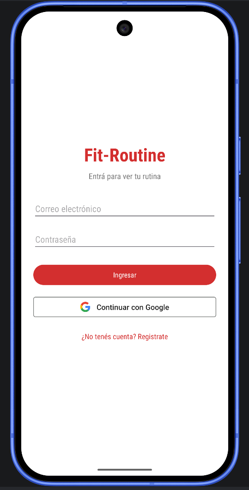
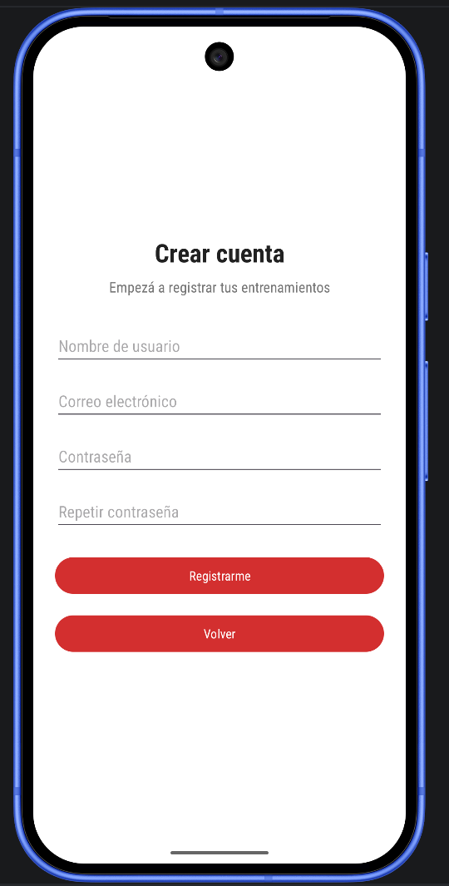
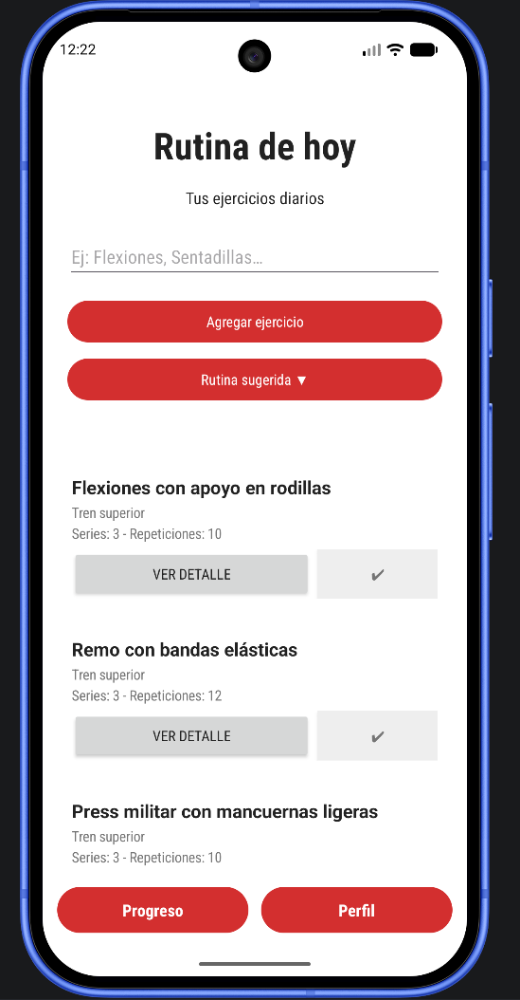
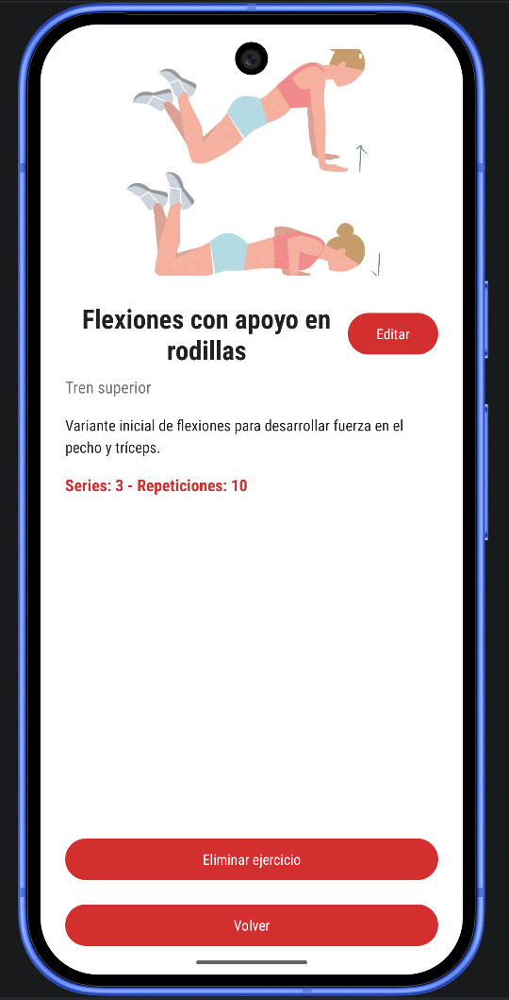
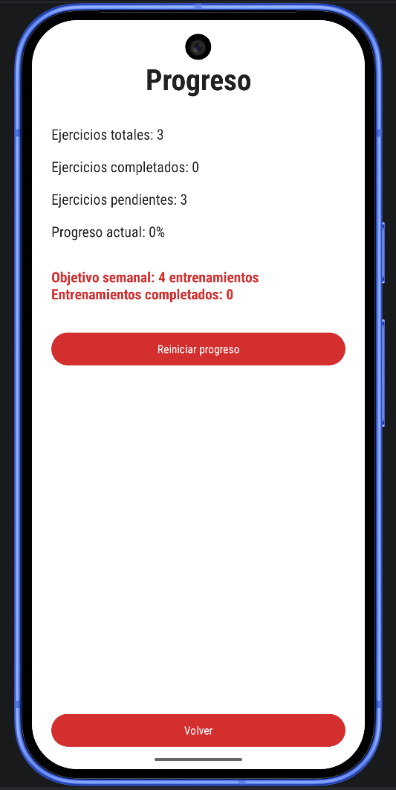
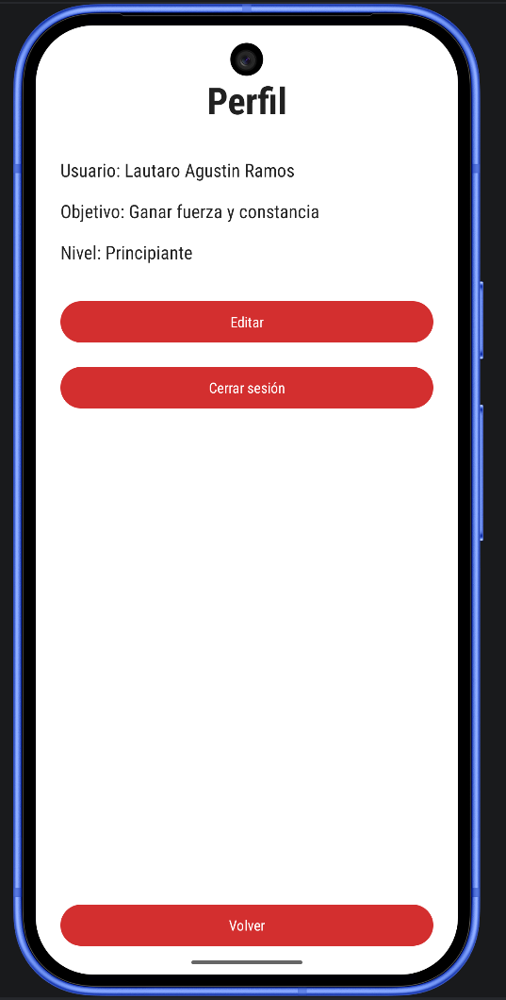

# Informe de pantallas — Fit-Routine

Aplicaciones Móviles — Comisión ACN4A
Repositorio: https://github.com/LautaroRDavinci/final-am-acn4a-ramos

Este informe describe cada pantalla de la aplicación: qué se ve, qué se puede hacer y cómo es el recorrido del usuario. Las capturas son de la app corriendo en el emulador.

---

## Mapa de navegación

```
                    ┌──────────────┐
                    │    Login     │ ◄──── pantalla de inicio
                    └──────┬───────┘
                           │
              ┌────────────┴────────────┐
              │                         │
      ┌───────▼────────┐        ┌───────▼────────┐
      │    Registro    │        │  correo/Google │
      └───────┬────────┘        └───────┬────────┘
              │                         │
              └────────────┬────────────┘
                           │
                    ┌──────▼───────┐
                    │    Rutina    │ ◄──── pantalla principal
                    └──────┬───────┘
                           │
         ┌─────────────────┼─────────────────┐
         │                 │                 │
 ┌───────▼──────┐  ┌───────▼──────┐  ┌───────▼──────┐
 │   Detalle    │  │   Progreso   │  │    Perfil    │
 │  ejercicio   │  │              │  │              │
 └──────────────┘  └──────────────┘  └───────┬──────┘
                                             │
                                       cerrar sesión
                                             │
                                             ▼
                                          Login
```

Las tres pantallas de abajo (Detalle, Progreso, Perfil) siempre vuelven a Rutina. La única salida hacia Login es cerrando sesión desde Perfil.

---

## 1. Login



**Para qué está**
Es la puerta de entrada. Ninguna otra pantalla es alcanzable sin pasar por acá.

**Qué tiene**
- Campo de correo electrónico
- Campo de contraseña (el texto se muestra oculto)
- Botón "Ingresar"
- Botón "Continuar con Google"
- Link "¿No tenés cuenta? Registrate"

**Flujo de uso**
1. El usuario abre la app.
2. Si ya había entrado antes, la app detecta la sesión guardada y lo manda directo a Rutina sin mostrar esta pantalla.
3. Si no, escribe su correo y su contraseña y toca "Ingresar".
4. Si los datos están bien, aparece un mensaje de "Sesión iniciada" y pasa a Rutina.
5. Si prefiere usar Google, toca "Continuar con Google", elige su cuenta del selector y entra igual.
6. Si todavía no tiene cuenta, toca el link de abajo y va a Registro.

**Validaciones**
- No deja ingresar con campos vacíos: avisa "Todos los campos son obligatorios".
- Si el correo o la contraseña no son correctos, avisa "No pudimos ingresar, revisá tu correo y contraseña".
- Mientras el pedido está en curso, el botón queda deshabilitado para que no se dispare dos veces.

---

## 2. Registro



**Para qué está**
Crear una cuenta nueva con correo y contraseña.

**Qué tiene**
- Campo de nombre
- Campo de correo electrónico
- Campo de contraseña
- Campo para repetir la contraseña
- Botón "Registrarme"
- Botón "Volver"

**Flujo de uso**
1. El usuario llega desde el link del Login.
2. Completa nombre, correo y las dos contraseñas.
3. Toca "Registrarme".
4. La app crea la cuenta, le guarda el nombre y lo lleva directo a Rutina. No tiene que volver a loguearse.
5. Si se arrepiente, "Volver" lo devuelve al Login.

**Validaciones**
Las tres se revisan en el celular antes de mandar nada al servidor, así el aviso es inmediato:
- Ningún campo puede quedar vacío.
- La contraseña necesita al menos 6 caracteres.
- Las dos contraseñas tienen que coincidir.

Si el correo ya está registrado, el servidor rechaza el pedido y la app avisa "No pudimos crear la cuenta, probá con otro correo".

---

## 3. Rutina (pantalla principal)



**Para qué está**
Es el centro de la app. Acá se arma y se completa la rutina del día.

**Qué tiene**
- Título y subtítulo
- Campo de texto para escribir un ejercicio
- Botón "Agregar ejercicio"
- Botón "Rutina sugerida", que despliega tres opciones: Tren superior, Tren inferior y Core
- La lista de ejercicios, dentro de una ScrollView. Cada tarjeta muestra nombre, grupo muscular, series y repeticiones, y tiene dos botones: "Ver detalle" y "✔"
- Barra de navegación inferior con "Progreso" y "Perfil"

**Flujo de uso**
1. Al entrar, la app busca en la base la rutina guardada del usuario y la muestra tal como la dejó, con los tildes puestos.
2. El usuario puede escribir un ejercicio y tocar "Agregar ejercicio", que lo suma al final de la lista.
3. O puede tocar "Rutina sugerida", elegir una de las tres categorías y cargar una rutina completa de una. El menú se cierra solo al elegir.
4. A medida que entrena, toca el ✔ de cada tarjeta. La tarjeta cambia de color y el nombre queda tildado.
5. Cuando marca el último ejercicio pendiente, salta un cartel de felicitación que le ofrece ir a Progreso.
6. Si quiere ver o cambiar un ejercicio, toca "Ver detalle".
7. Con los botones de abajo va a Progreso o a Perfil.

**Validaciones**
- Si toca "Agregar ejercicio" con el campo vacío, avisa "Ingrese un ejercicio" y no agrega nada.

**Qué se guarda**
Todo. Agregar, tildar, destildar, editar y borrar se escriben en la base en el momento.

---

## 4. Detalle del ejercicio



**Para qué está**
Ver la información completa de un ejercicio y poder cambiarla o borrarlo.

**Qué tiene**
En modo visualización:
- Foto del ejercicio, descargada de internet
- Nombre, grupo muscular, descripción, series y repeticiones
- Botones "Editar", "Eliminar ejercicio" y "Volver"

En modo edición (aparece en la misma pantalla):
- Campos para nombre, descripción, series, repeticiones y URL de la imagen
- Botones "Guardar" y "Cancelar"

**Flujo de uso**
1. El usuario llega tocando "Ver detalle" en una tarjeta de la Rutina.
2. Ve la foto y los datos del ejercicio.
3. Si toca "Editar", los datos se reemplazan por campos de texto cargados con los valores actuales.
4. Modifica lo que quiera y toca "Guardar". Vuelve al modo visualización con los datos nuevos, y el cambio queda guardado en la base.
5. Si cambió la URL de la imagen, la foto nueva se descarga y se muestra.
6. Si toca "Cancelar", vuelve a visualización sin guardar nada.
7. Si toca "Eliminar ejercicio", el ejercicio desaparece de la rutina y la pantalla se cierra.
8. "Volver" lo devuelve a Rutina.

**Validaciones**
- El nombre no puede quedar vacío.
- Series y repeticiones tienen que ser números. Si escribe letras, avisa y no guarda.
- Si la imagen no carga o la URL está mal, se muestra un fondo gris en vez de romperse.

---

## 5. Progreso



**Para qué está**
Mostrar cómo viene la rutina del día y cuántos entrenamientos lleva en la semana.

**Qué tiene**
- Ejercicios totales, completados y pendientes
- Porcentaje de avance de la rutina actual
- Objetivo semanal y cantidad de entrenamientos completados
- Botón "Reiniciar progreso"
- Botón "Volver"

**Flujo de uso**
1. El usuario llega desde el botón "Progreso" de la barra inferior, o desde el cartel de felicitación de la Rutina.
2. Ve sus números. Si todavía no cargó ejercicios, en vez del porcentaje le aparece "Agregá ejercicios para ver tu progreso".
3. Si completó toda la rutina, ve "Rutina completada".
4. Si llegó a 4 entrenamientos en la semana, salta un cartel de objetivo cumplido. Al aceptarlo, el contador vuelve a 0 y arranca una semana nueva.
5. Si toca "Reiniciar progreso", se vacía la rutina del día para empezar una nueva. El contador semanal no se toca.
6. "Volver" lo devuelve a Rutina.

**Detalle de la comunicación entre pantallas**
Esta pantalla recibe los números desde Rutina como extras del Intent, y le devuelve las órdenes de vaciar la rutina o reiniciar el contador semanal como resultado.

---

## 6. Perfil



**Para qué está**
Ver y editar los datos personales, y cerrar sesión.

**Qué tiene**
En modo visualización:
- Usuario, Objetivo y Nivel
- Botones "Editar", "Cerrar sesión" y "Volver"

En modo edición:
- Campos para nombre de usuario, objetivo y nivel
- Botones "Guardar" y "Cancelar"

**Flujo de uso**
1. El usuario llega desde el botón "Perfil" de la barra inferior.
2. Ve sus datos. El nombre es el que puso al registrarse, o el de su cuenta de Google.
3. Si toca "Editar", los datos se reemplazan por campos cargados con los valores actuales.
4. Cambia lo que quiera y toca "Guardar". Los datos se actualizan en pantalla, se guardan en la base y se avisa con "Perfil actualizado".
5. Si toca "Cancelar", vuelve sin guardar.
6. Si toca "Cerrar sesión", la app cierra la sesión y lo devuelve al Login. El botón "atrás" ya no lo puede traer de vuelta a la rutina.
7. "Volver" lo devuelve a Rutina.

**Validaciones**
- Ninguno de los tres campos puede quedar vacío al guardar.

---

## Cómo se conectan las pantallas

El pasaje de datos entre pantallas se hace con extras del Intent en los dos sentidos:

| Desde | Hacia | Qué viaja |
|---|---|---|
| Rutina | Detalle | índice, nombre, descripción, grupo muscular, URL de imagen, series y reps |
| Detalle | Rutina | los datos editados, o la orden de eliminar |
| Rutina | Progreso | ejercicios totales, completados y contador semanal |
| Progreso | Rutina | orden de vaciar la rutina o de reiniciar el contador |
| Rutina | Perfil | nombre, objetivo y nivel |
| Perfil | Rutina | los datos editados |

---

## Requisitos para probar la app

- Android 7.0 o superior.
- Conexión a internet, para el login y para las fotos de los ejercicios.
- Si se quiere probar el ingreso con Google, el emulador tiene que tener Google Play Services. El ingreso con correo funciona igual en cualquier emulador.
